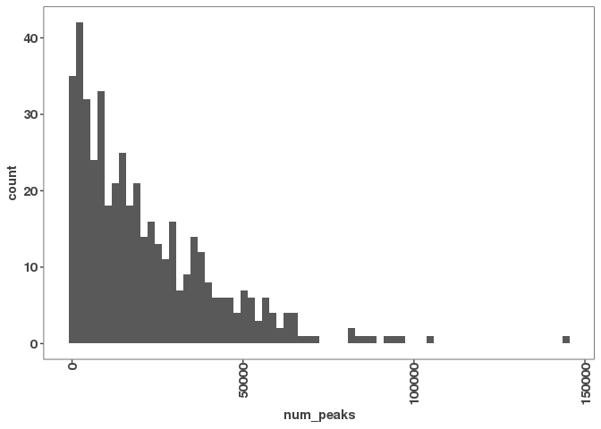
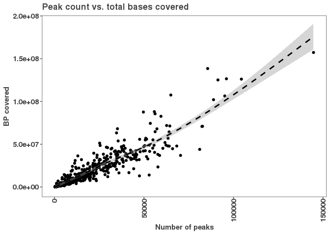
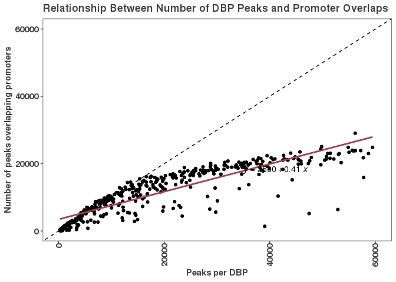
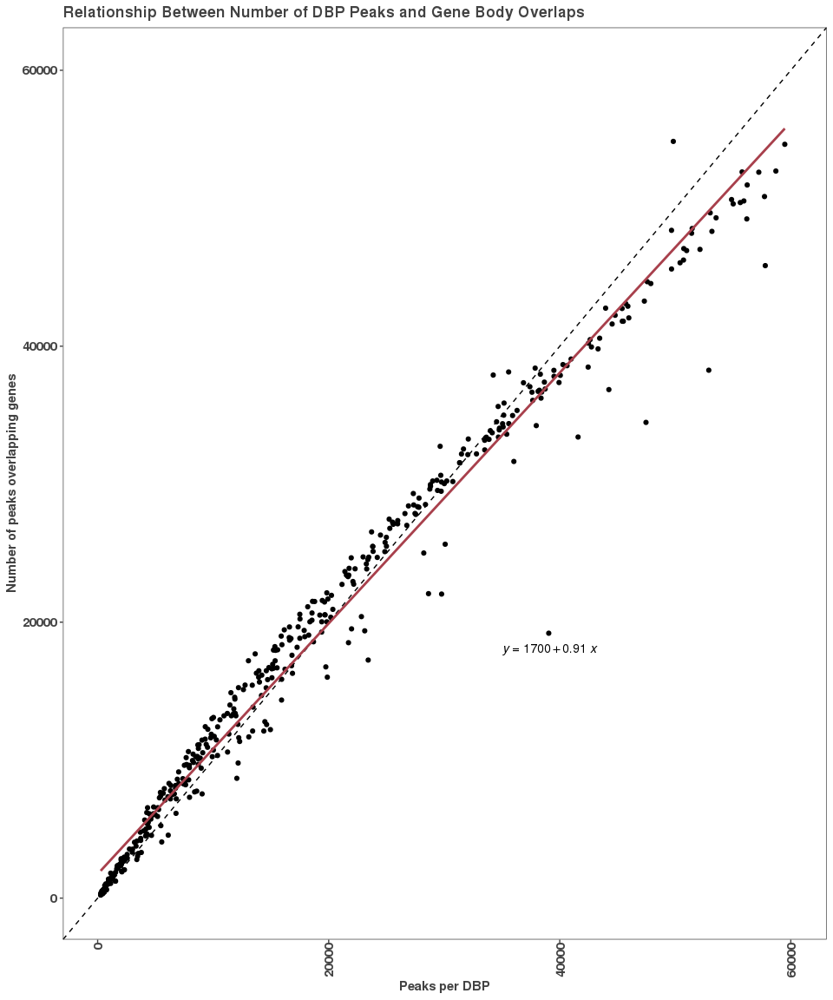

Knitting example
================
JR
4/18/2022

# Test run of a knit

# Analysis of peak features for each DBP

We’ve previous made a dataframe containing a number of features for each
DNA binding protein and we will create some plots to examine these
relationships here.

``` r
# reading in num_peaks_df
num_peaks_df <- read_csv("analysis/results/num_peaks_df.csv")
```

## Histogram of peak count per DBP

``` r
# Distriubtion of peak numbers of all 460 DBPs
ggplot(num_peaks_df, aes(x = num_peaks)) + 
  geom_histogram(bins = 70)
```

<!-- -->

``` r
summary(num_peaks_df$num_peaks)
```

    ##    Min. 1st Qu.  Median    Mean 3rd Qu.    Max. 
    ##     261    5643   15736   21524   32053  144675

The median number of peaks is nearly 16,000, but most DBPs tend to have
many fewer binding events. The distribution looks like an expotential
decay. Surprisingly, one DBP has nearly 150,000 peaks.

``` r
# Plotting number of peaks versus total genome coverage
ggplot(num_peaks_df, aes(x = num_peaks, y = total_peak_length)) +
  geom_point() + 
  geom_smooth(method = "gam", se = TRUE, color = "black", lty = 2)+
  ylab("BP covered") +
  xlab("Number of peaks") +
  ggtitle("Peak count vs. total bases covered")
```

    ## `geom_smooth()` using formula 'y ~ s(x, bs = "cs")'

<!-- -->

``` r
# Plotting number of peaks versus peaks overlapping promoters
ggplot(num_peaks_df,
       aes(x = num_peaks, y = peaks_overlapping_promoters)) +
  xlab("Peaks per DBP") +
  ylab("Number of peaks overlapping promoters") +
  ggtitle("Relationship Between Number of DBP Peaks and Promoter Overlaps")+
  geom_point() +
  geom_abline(slope = 1, linetype="dashed") +
  geom_smooth(method = "lm", se=FALSE, formula = 'y ~ x',
              color = "#a8404c") +
  stat_regline_equation(label.x = 35000, label.y = 18000) +
  ylim(0,60100) +
  xlim(0,60100)
```

    ## Warning: Removed 23 rows containing non-finite values (stat_smooth).

    ## Warning: Removed 23 rows containing non-finite values (stat_regline_equation).

    ## Warning: Removed 23 rows containing missing values (geom_point).

<!-- -->

``` r
# Plotting peak overlaps with genebody
ggplot(num_peaks_df,
       aes(x = num_peaks, y = peaks_overlapping_genebody)) +
  xlab("Peaks per DBP") +
  ylab("Number of peaks overlapping genes") +
  ggtitle("Relationship Between Number of DBP Peaks and Gene Body Overlaps")+
  geom_point() +
  geom_abline(slope = 1, linetype="dashed") +
  geom_smooth(method = "lm", se=F, formula = 'y ~ x',
              color = "#a8404c") +
  stat_regline_equation(label.x = 35000, label.y = 18000) +
  ylim(0,60100) +
  xlim(0,60100)
```

<!-- -->
